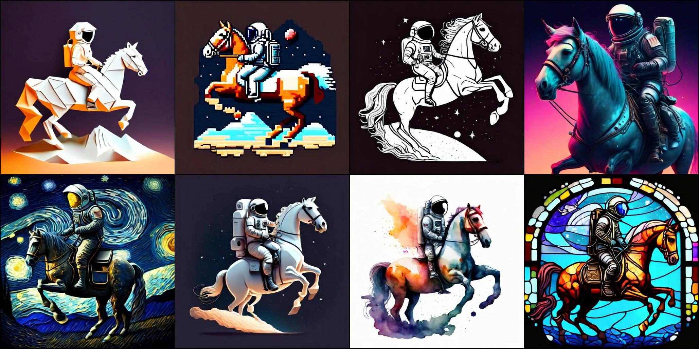

# Stretching Each Dollar: Diffusion Training from Scratch on a Micro-Budget
This repository provides a minimalistic implementation of our approach to training large-scale diffusion models from scratch on an extremely low budget. In particular, using only 37M publicly available real and synthetic images, we train a 1.16 billion parameter sparse transformer with a total cost of only $1,890 and achieve an FID of 12.7 in zero-shot generation on the COCO dataset. Please find further details in the official paper: https://arxiv.org/abs/2407.15811.

<figure style="text-align: center;">
  
  Prompt: <em>'Image of an astronaut riding a horse in {} style'.</em> Styles: Origami, Pixel art, Line art, Cyberpunk, Van Gogh Starry Night, Animation, Watercolor, Stained glass
</figure>


The current codebase enables the reproduction of our models, as it provides both the training code and the dataset code used in the paper. We also provide pre-trained model checkpoints for off-the-shelf generation.

## Installation

Clone the repository and install micro_diffusion as a Python package using the following command.
```
pip install -e .
```

## Datasets Setup
First, set up the necessary directories to store the datasets and training artifacts.
```bash
ln -s path_to_dir_that_stores_data ./datadir
ln -s path_to_dir_that_stores_trained_models ./trained_models
```

Next, download the training dataset by following [datasets.md](./micro_diffusion/datasets/README.md). It provides instructions on downloading and precomputing the image and caption latents for all five datasets used in the paper. As downloading and precomputing latents for entire datasets can be time-consuming, it supports downloading and using only a small (~1%) fraction of each dataset, instead of the full dataset. We strongly recommend working with this small subset for initial experimentation.

## Training Stages for Micro-Budget Models
We progressively train the models from low resolution to high resolution. We first train the model on 256×256 resolution images for 280K steps and then fine-tune the model for 55K steps on 512×512 resolution images. The estimated training time for the end-to-end model on an 8×H100 machine is 2.6 days. We provide the training configuration for each stage in the ./yamls/ directory.

**Patch masking**: Our DiT model by default uses a patch-mixer before the backbone transformer architecture. Using the patch-mixer significantly reduces performance degradation with masking while providing a large reduction in training time. We mask 75% of the patches after the patch mixer across both resolutions. After training with masking, we perform a follow-up fine-tuning with a mask ratio of 0 to slightly improve performance. Overall, the training includes four steps.


### Step-1: Pre-training at 256x256 image resolution with 75% patch masking
```bash
composer train.py --config-path ./configs --config-name res_256_pretrain.yaml exp_name=MicroDiTXL_mask_75_res_256_pretrain model.train_mask_ratio=0.75
```

### Step-2: Finetuning at 256x256 image resolution with no patch masking
```bash
composer train.py --config-path ./configs --config-name res_256_finetune.yaml exp_name=MicroDiTXL_mask_0_res_256_finetune model.train_mask_ratio=0.0 trainer.load_path=./trained_models/MicroDiTXL_mask_75_res_256_pretrain/latest-rank0.pt
```
### Step-3: Finetuning at 512x512 image resolution with 75% patch masking
```bash
composer train.py --config-path ./configs --config-name res_512_pretrain.yaml exp_name=MicroDiTXL_mask_75_res_512_pretrain model.train_mask_ratio=0.75 trainer.load_path=./trained_models/MicroDiTXL_mask_0_res_256_finetune/latest-rank0.pt
```
### Step-4: Finetuning at 512x512 image resolution with no patch masking
```bash
composer train.py --config-path ./configs --config-name res_512_finetune.yaml exp_name=MicroDiTXL_mask_0_res_512_finetune model.train_mask_ratio=0.0 trainer.load_path=./trained_models/MicroDiTXL_mask_75_res_512_pretrain/latest-rank0.pt
```

Across all steps, we use a batch size of 2,048, apply center cropping, and do not horizontally flip the images.

## Pre-trained Model Checkpoints
We release four pre-trained models ([HF](https://huggingface.co/VSehwag24/MicroDiT)). The table below provides download links and a description of each model.
| Model Description | VAE (channels) | FID  | GenEval Score | Download |
|------------------|-----|:------: |:------:|:---------------:|
| MicroDiT_XL_2 trained on 22M real images  | SDXL-VAE (4 channel) | 12.72 | 0.46 | [link](https://huggingface.co/VSehwag24/MicroDiT/resolve/main/ckpts/dit_4_channel_22M_real_only_data.pt) |
| MicroDiT_XL_2 trained on 37M images (22M real, 15M synthetic) | SDXL-VAE (4 channel) | **12.66** | 0.46 | [link](https://huggingface.co/VSehwag24/MicroDiT/resolve/main/ckpts/dit_4_channel_37M_real_and_synthetic_data.pt) |
| MicroDiT_XL_2 trained on 37M images (22M real, 15M synthetic) | Ostris-VAE (16 channel) | 13.04 | 0.40 | [link](https://huggingface.co/VSehwag24/MicroDiT/resolve/main/ckpts/dit_16_channel_37M_real_and_synthetic_data.pt) |
| MicroDiT_XL_2 trained on 490M synthetic images | SDXL-VAE (4 channel) | 13.26 | **0.52** | [link](https://huggingface.co/VSehwag24/MicroDiT/resolve/main/ckpts/dit_4_channel_0.5B_synthetic_data.pt) |

All four models are trained with nearly identical training configurations and computational budgets.


## Sampling
Use the following straightforward steps to generate images from the final model at 512×512 resolution.
```python
from micro_diffusion.models.model import create_latent_diffusion
model = create_latent_diffusion(latent_res=64, in_channels=4, pos_interp_scale=2.0).to('cuda')
model.dit.load_state_dict(torch.load(final_ckpt_path_on_local_disk)) # use model.load_state_dict if ckpt includes vae and text-encoder
gen_images = model.generate(prompt=['An elegant squirrel pirate on a ship']*4, num_inference_steps=30, 
                                    guidance_scale=5.0, seed=2024)
```

## Acknowledgements
We would like to thank previous open-source efforts that we utilize in our code, in particular, the Composer training framework, streaming dataloaders, the Diffusers library, and the original Diffusion Transformers (DiT) implementation.

## License
The code and model weights are released under Apache 2.0 License. 

## BibTeX
```bibtex
@article{Sehwag2024MicroDiT,
  title={Stretching Each Dollar: Diffusion Training from Scratch on a Micro-Budget},
  author={Sehwag, Vikash and Kong, Xianghao and Li, Jingtao and Spranger, Michael and Lyu, Lingjuan},
  journal={arXiv preprint arXiv:2407.15811},
  year={2024}
}
```
